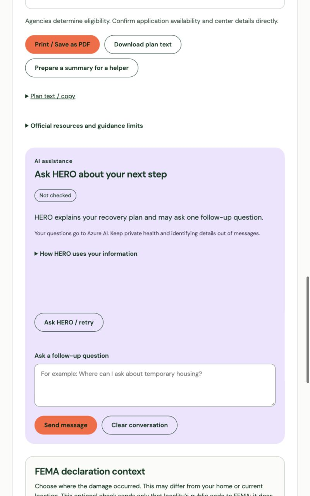
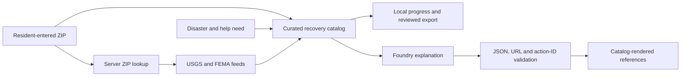

# HERO

**US Disaster Assistance Navigator** · Hazard & Emergency Response Organizers

HERO gives people across the United States a usable recovery plan based on their current ZIP area, reported disaster type, and type of help needed. The map starts on **Charlottesville, Virginia as an example**, with the visitor's ZIP blank. A guest can finish the survey, track actions, and export a reviewed summary without an account or AI.

## Try the resident journey

1. Open **Find help now** (`/help.html`). The map and a synchronized resource list appear first; the four-question survey is directly below.
2. Answer the immediate-danger gate, enter or skip a five-digit current ZIP, choose a disaster type, then choose a need. ZIPs identify approximate areas, never street addresses. An unresolved ZIP leaves federal guidance available.
3. HERO shows a deterministic first step before any AI reply. If a relevant FEMA-reported shelter or recovery center appears near the entered ZIP, the plan may link to its map card with an instruction to check and confirm it. Otherwise the plan uses the official federal sites. Hospitals and fire/EMS stations are directory pins only, never emergency travel instructions.
4. Mark resident-reported progress; print or download the plan. Optionally ask Foundry to explain the approved actions.
5. Review and edit the helper summary before exporting it. A local listing appears only if you select **Include in helper summary**. Exporting does not contact a helper, create a case, or reserve assistance.



## What is implemented

| Area | Behavior |
| --- | --- |
| ZIP lookup | Bundled GeoNames data for 41,195 ZIPs across states, DC, Puerto Rico, American Samoa, Guam, the Northern Mariana Islands, and the U.S. Virgin Islands; keyless Zippopotam.us lookup only on a bundle miss |
| Map | Local Leaflet code, OpenStreetMap tiles, bounded USGS hospital/fire station directory pins, FEMA-reported open shelter and recovery-center pins; source checks and partial failures are visible; resource list remains usable without tiles |
| Survey | Four questions: safety, current ZIP, disaster type, and help need. Charlottesville is never inferred as the current location |
| Recovery | Need-specific curated actions, disaster-specific preparation, ZIP-area context, cautious FEMA listing checks, progress stored only in the current tab |
| Handoff | Editable helper summary with current ZIP, selected disaster, optional damage ZIP, progress, approved links, and only explicitly selected local and saved-household details |
| AI | Foundry explains server-approved candidate actions; strict `{reply,actionIds}` validation rejects invented actions and links; emergencies bypass AI |
| Profile | Optional encrypted SQLite profile; a home ZIP can be saved. Old Virginia localities remain read-only legacy information and never imply a ZIP |
| FEMA context | Separate damage ZIP and explicit county/county-equivalent confirmation from the Census 2020 ZCTA relationship file; unknown state when a county cannot be established |
| Languages | English, Spanish, Arabic, Simplified Chinese, Korean, Vietnamese, Tagalog, and French; native-name welcome menu and Arabic right-to-left layout |
| Offline | Versioned public shell only; no private/API data or OpenStreetMap tiles in the service-worker cache |

The recovery plan's **external referrals** remain limited to [DisasterAssistance.gov](https://www.disasterassistance.gov/) and the [FEMA Disaster Recovery Center locator](https://egateway.fema.gov/ESF6/DRCLocator). Map pins can link internally to their cards. The preparedness checklist has its separate Ready.gov sources.

## Architecture and data boundaries



Rules choose actions, validate ZIPs and county candidates, distinguish directory facilities from FEMA listings, and preserve the emergency gate. Foundry writes optional short explanations; it does not create an action, verify eligibility or live availability, submit an application, or contact responders. Saved health, disability, access, and support answers are excluded from AI and helper-summary exports. Only an explicitly selected home ZIP and household size may be shared with AI. Summary edits remain in page memory.

ZIP-to-place data comes from [GeoNames](https://download.geonames.org/export/zip/) (CC BY 4.0). County candidates come from the [Census 2020 ZCTA-to-county relationship file](https://www2.census.gov/geo/docs/maps-data/data/rel2020/zcta520/tab20_zcta520_county20_natl.txt). ZIP delivery areas and Census ZCTAs do not match exactly; a ZIP does not establish a street address or damage county. See [data provenance](data/README.md).

The map uses [USGS structures](https://carto.nationalmap.gov/arcgis/rest/services/structures/MapServer), [FEMA shelters](https://gis.fema.gov/arcgis/rest/services/NSS/FEMA_NSS/FeatureServer), and [FEMA recovery centers](https://gis.fema.gov/arcgis/rest/services/FEMA/DRC/FeatureServer). Permanent facilities are directory locations, not confirmed available aid. FEMA listings can be empty, stale, or temporarily unavailable; always confirm details with the official source. Map tiles use the [OpenStreetMap tile service](https://operations.osmfoundation.org/policies/tiles/) with attribution and ordinary browser caching; HERO does not prefetch or store tiles offline.

## Run locally

Requires Node.js 24, npm, and Azure CLI only if using the hosted Foundry agent.

```sh
npm install
npm start
# Open http://127.0.0.1:3000/help.html
npm test
```

The guest plan works without Azure credentials. For optional AI, configure `.env` from `.env.example`; the earlier [Azure and account setup notes](FLOOD_GUIDE_README.md) provide additional background. Do not commit credentials.

```sh
npm run sync:ai-policy             # Compare local and stored agent instructions
npm run sync:ai-policy -- --apply  # Create a stored agent version when needed
npm run check:ai -- --base=http://127.0.0.1:3000 --languages=en,es
```

The source data build script is [docs/build-zip-data.py](docs/build-zip-data.py). Public translation sources and the bundle builder are in `docs/` and `locales/`.

## Verification and limits

Run `npm test` for API, migration, feed-failure, privacy, action-validation, and progress tests. A real Foundry request is a separate check because it depends on the configured agent and network. The [nationwide walkthrough](docs/evidence/nationwide-walkthrough.md) and [final live AI report](docs/evidence/live-ai-nationwide-final.json) record a single scripted browser run and English/Spanish Foundry replies. Older evidence and the demonstration in `demo/` describe the previous Virginia build; they are not nationwide performance claims.

HERO cannot assess emergencies, confirm current facility availability, determine eligibility, or dispatch help. In immediate danger or with serious injury, call 911. A human translation and screen-reader review, OS print/download check, and current-build video walkthrough remain appropriate release checks. No cost-saving or assistance-outcome claims are made.
